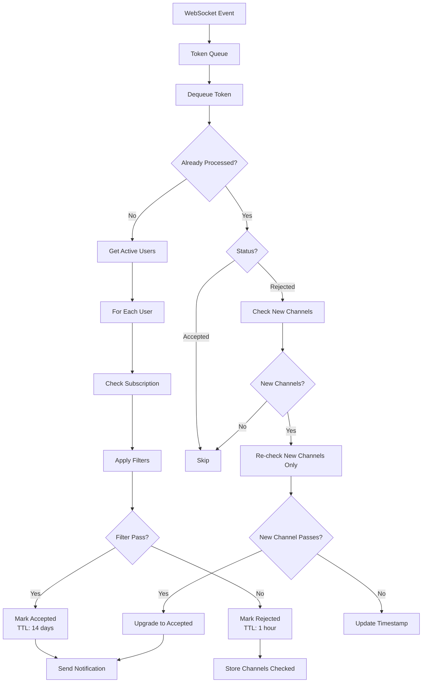
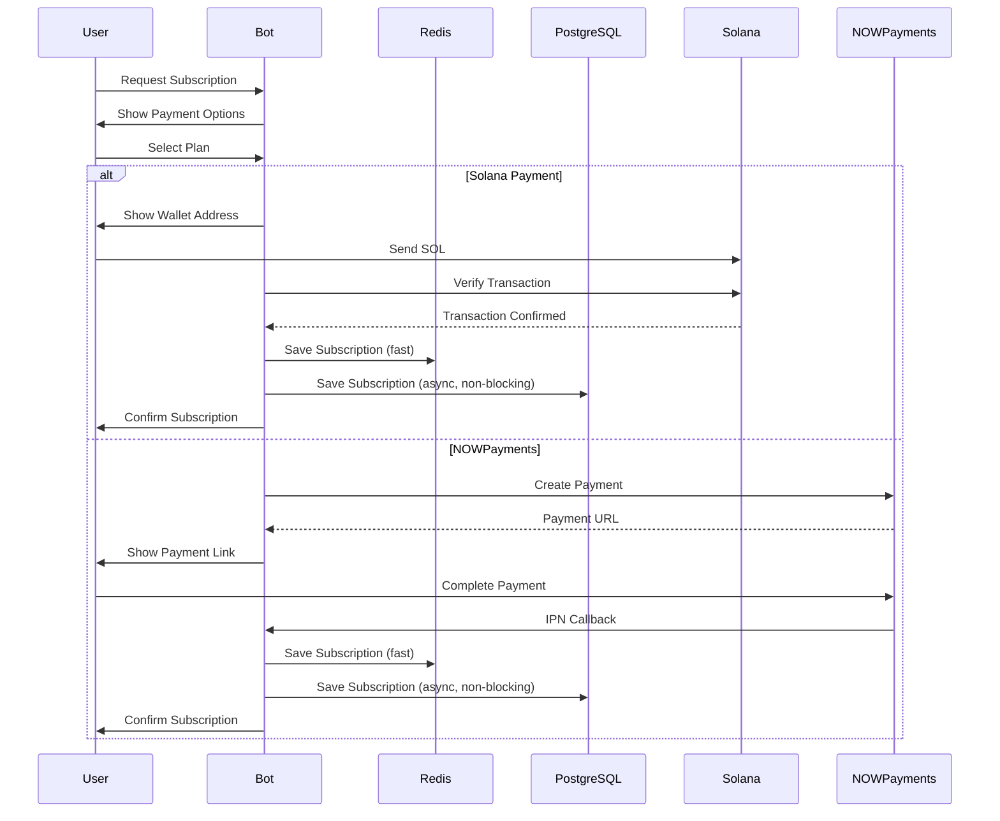

# System Architecture - Detailed Documentation

## Table of Contents

- [System Overview](#system-overview)
- [Component Architecture](#component-architecture)
- [Data Flow](#data-flow)
- [Caching Strategy](#caching-strategy)
- [Error Handling & Resilience](#error-handling--resilience)
- [Scalability Considerations](#scalability-considerations)

---

## System Overview

The bot is built using a modular, service-oriented architecture with clear separation of concerns and dual-write data architecture:

```
┌─────────────────────────────────────────────────────────────┐
│                    Main Entrypoint (main.py)                │
│              Orchestrates bot lifecycle                     │
└──────────────────────┬──────────────────────────────────────┘
                       │
                       ▼
┌─────────────────────────────────────────────────────────────┐
│              TelegramBot (Core Orchestrator)                 │
│  - TokenFilterBot (base class)                              │
│  - UserSettingsMixin                                         │
│  - PaymentsMixin                                             │
│  - Admin Mixins (10+ mixins)                                │
└──────────────────────┬──────────────────────────────────────┘
                       │
        ┌──────────────┼──────────────┐
        │              │              │
        ▼              ▼              ▼
┌──────────────┐ ┌──────────────┐ ┌──────────────┐
│   Services   │ │   Handlers   │ │   Managers   │
│              │ │              │ │              │
│ - Notif      │ │ - Command    │ │ - Redis      │
│ - Reporting  │ │ - Callback   │ │ - WebSocket  │
│ - Monitoring │ │ - Input      │ │ - PostgreSQL │
│ - Multiplier │ │              │ │              │
└──────────────┘ └──────────────┘ └──────────────┘
                       │
        ┌──────────────┼──────────────┐
        │              │              │
        ▼              ▼              ▼
┌──────────────┐ ┌──────────────┐ ┌──────────────┐
│    Redis     │ │  PostgreSQL  │ │   External   │
│  (Real-time) │ │ (Permanent)  │ │     APIs     │
└──────────────┘ └──────────────┘ └──────────────┘
```

---

## Component Architecture

### 1. Core Bot Class (`TokenFilterBot`)

**Responsibilities:**
- Initialize Redis, WebSocket, HTTP connections
- Process tokens from WebSocket/API
- Manage caches and rate limiting
- Coordinate all services

**Key Attributes:**
```python
# Connection Management
- redis_manager: RedisManager
- websocket_manager: WebSocketManager
- session: aiohttp.ClientSession (API)
- telegram_session: aiohttp.ClientSession (Telegram)

# Caching
- channels_cache: SmartCache (30 min TTL)
- user_settings_cache: SmartCache (5 min TTL)
- subscription_cache: SmartCache (5 min TTL)

# Processing
- token_queue: asyncio.Queue (10,000 capacity)
- user_processing_semaphore: asyncio.Semaphore (max 5)
- api_semaphore: asyncio.Semaphore (max 10)
```

### 2. Service Layer

#### Notification Service
- Processes tokens for all active users
- Applies user-specific filters
- Sends notifications via Telegram
- Handles video/media notifications

#### Reporting Service
- Daily reports (scheduled at 20:00 UTC)
- Best reports (scheduled at 21:00 UTC)
- Preset notifications
- Performance reports

#### Monitoring Service
- Health checks (Redis, WebSocket)
- Heartbeat logging
- Performance metrics
- Alert generation

#### Multiplier Service
- Tracks token price multipliers
- Real-time price updates via WebSocket
- Sends multiplier notifications (2x, 5x, 10x, etc.)
- Performance reporting

### 3. Manager Layer

#### Redis Manager
```python
class RedisManager:
    - Connection pooling
    - Health monitoring (every 30s)
    - Automatic reconnection
    - Circuit breaker pattern
    - Graceful degradation
```

#### WebSocket Manager
```python
class WebSocketManager:
    - Real-time token stream
    - Automatic reconnection
    - Event deduplication
    - Queue management
    - Health monitoring
```

#### PostgreSQL Manager
```python
class PostgresManager:
    - Connection pooling (5-20 connections)
    - Async operations (asyncpg)
    - Health monitoring
    - Query timeout protection
    - Graceful error handling
```

### 4. Handler Layer

#### Command Handler
- Processes Telegram commands (`/start`, `/settings`, etc.)
- Menu navigation
- User input validation

#### Callback Handler
- Inline button callbacks
- Menu state management
- User action processing

#### Input Handler
- Custom user input (filters, settings)
- Context-aware processing
- Input validation

---

## Data Flow

### Token Processing Flow



### Payment Flow



---

## Data Architecture

### Dual-Write Pattern (Redis + PostgreSQL)

The system uses a dual-write architecture where critical data is written to both Redis (for speed) and PostgreSQL (for permanence):

**Redis (Primary - Real-time):**
- Active subscriptions (fast lookups)
- Processed tokens (deduplication)
- User settings cache
- Session data
- Real-time state

**PostgreSQL (Secondary - Permanent):**
- Subscription history (analytics)
- Payment transactions (audit trail)
- User activity logs
- Token performance tracking
- Settings change history
- Notification history

**Write Strategy:**
1. Write to Redis first (critical path)
2. Write to PostgreSQL asynchronously (non-blocking)
3. If PostgreSQL fails, system continues (Redis is source of truth)
4. PostgreSQL failures are logged but don't affect user experience

**Benefits:**
- Fast operations (Redis)
- Permanent storage (PostgreSQL)
- Analytics capabilities
- Audit trail
- Graceful degradation

## Caching Strategy

### Three-Layer Cache Architecture

#### Layer 1: In-Memory Cache (SmartCache)

**Purpose:** Fast access to frequently accessed data

**Implementation:**
```python
class SmartCache:
    - TTL-based expiration
    - LRU eviction when full
    - Thread-safe operations
    - Periodic cleanup
```

**Cache Types:**
- **Channel Data:** 30 min TTL, max 1000 entries
- **User Settings:** 5 min TTL, max 5000 entries
- **Subscriptions:** 5 min TTL, max 5000 entries
- **Telegram Permissions:** 5 min TTL, max 1000 entries
- **Wallet Info:** 30 sec TTL, max 5000 entries

**Performance:**
- Lookup: ~0.1ms
- Hit Rate: 95%+

#### Layer 2: Redis Cache (Processed Tokens)

**Purpose:** Prevent duplicate processing, enable re-checking

**Key Format:** `processed_token:{token_address}:{user_id}`

**Value Structure:**
```json
{
  "timestamp": "2025-01-14T10:30:00.123456",
  "channels_checked": ["@channel1", "@channel2"],
  "status": "accepted" | "rejected",
  "channels_called_at": {
    "channel_id": "called_at_timestamp"
  }
}
```

**TTL Strategy:**
- **Accepted tokens:** 14 days (prevents duplicate notifications)
- **Rejected tokens:** 1 hour (allows re-checking when new channels appear)

**Performance:**
- Lookup: ~1-5ms (Redis)
- Hit Rate: 95%+

#### Layer 3: Redis Cache (Channel Metadata)

**Purpose:** Cache channel statistics (win_rate, avg_gain, etc.)

**Key Format:** `channel:{channel_id}:info`

**TTL:** 30 minutes

**Performance:**
- Lookup: ~1-5ms (Redis)
- Reduces API calls by 90%+

### Cache Invalidation Strategy

1. **TTL-based:** Automatic expiration
2. **Manual:** Admin actions (preset changes, etc.)
3. **Event-based:** Subscription changes, user settings updates

---

## Error Handling & Resilience

### 1. Redis Connection Resilience

**Strategy:**
- Automatic reconnection with exponential backoff
- Health monitoring (checks every 30s)
- Circuit breaker (stops retrying after threshold)
- Runtime fallback cache (in-memory)

**Implementation:**
```python
class RedisManager:
    async def check_health(self):
        # Ping Redis, measure latency
        # Mark as unhealthy if timeout
    
    async def reconnect(self):
        # Exponential backoff
        # Max 5 attempts
        # Circuit breaker after threshold
```

**Result:** 99.9% uptime even during Redis maintenance.

### 2. WebSocket Resilience

**Strategy:**
- Automatic reconnection (every 10 seconds)
- Event deduplication (timestamp-based)
- Queue buffering (10,000 capacity)
- Fallback to API polling (if enabled)

**Implementation:**
```python
class WebSocketManager:
    async def reconnect(self):
        # Close existing connection
        # Wait 10 seconds
        # Reconnect with retry
        # Resubscribe to tokens
```

**Result:** Handles network interruptions gracefully.

### 3. API Error Handling

**Strategy:**
- Retry with exponential backoff
- Circuit breaker pattern
- Timeout handling (2-8 seconds)
- Graceful degradation

**Implementation:**
```python
class APIRetryManager:
    async def call_with_retry(self, func, max_retries=3):
        # Try function
        # On error: wait (exponential backoff)
        # Retry up to max_retries
        # Circuit breaker after threshold
```

**Result:** Handles temporary API failures without crashing.

### 4. Telegram API Resilience

**Strategy:**
- Rate limiting (prevents bans)
- Retry with exponential backoff
- Timeout handling
- Graceful degradation (skip notification if fails)

**Implementation:**
```python
class TelegramRateLimiter:
    async def wait_if_needed(self, user_id, priority=False):
        # Check per-user limit (1 msg/sec)
        # Check global limit (30 msg/sec)
        # Wait if needed
        # Priority operations skip per-user limit
```

**Result:** Zero Telegram API bans, smooth user experience.

---

## Scalability Considerations

### Current Capacity

- **Users:** 100+ concurrent users
- **Tokens:** 25,000+ tokens tracked
- **Tracked Calls:** 2.5M+ multiplier entries
- **Throughput:** 1000+ token events/minute

### Scalability Optimizations

#### 1. Horizontal Scaling (Future)

**Current:** Single bot instance

**Potential:** Multiple bot instances with:
- Shared Redis (state synchronization)
- Load balancer (distribute users)
- Message queue (distribute tokens)

#### 2. Database Optimization

**Current:** Redis-only (fast, but limited querying)

**Potential:** PostgreSQL for:
- Analytics queries
- Historical data
- Complex reporting

#### 3. Caching Optimization

**Current:** Multi-layer cache (95%+ hit rate)

**Potential:**
- CDN for static assets
- Distributed cache (Redis Cluster)
- Cache warming strategies

#### 4. Processing Optimization

**Current:** Queue-based, semaphore-controlled

**Potential:**
- Worker pool scaling
- Priority queues
- Batch processing

---

## Deployment Architecture

### Production Setup

```
┌─────────────────────────────────────────┐
│         Load Balancer / Nginx           │
│      (HTTPS, SSL termination)          │
└──────────────┬──────────────────────────┘
               │
               ▼
┌─────────────────────────────────────────┐
│         Docker Container                │
│  ┌──────────────────────────────────┐  │
│  │  Bot Application (Python)        │  │
│  │  - Main process                  │  │
│  │  - Background workers           │  │
│  └──────────────────────────────────┘  │
└──────────────┬──────────────────────────┘
               │
    ┌──────────┼──────────┐
    │          │          │
    ▼          ▼          ▼
┌────────┐ ┌────────┐ ┌────────┐
│ Redis  │ │  API   │ │Telegram│
│        │ │        │ │   API  │
└────────┘ └────────┘ └────────┘
```

### Process Management

**Production:** systemd service
- Auto-restart on failure
- Log rotation
- Resource limits
- Health monitoring

**Development:** Docker Compose
- Redis service
- Bot service
- Volume mounts for code
- Environment variables

---

## Monitoring & Observability

### Logging Strategy

**Log Files:**
- `bot.log` - Main application logs
- `payments.log` - Payment transactions
- `rediserror.log` - Redis errors
- `redisperformance.log` - Redis performance
- `sent_notifications.log` - Notification tracking
- `user_settings.log` - User setting changes

**Log Levels:**
- DEBUG: Development only
- INFO: Normal operations
- WARNING: Recoverable errors
- ERROR: Critical errors

### Health Checks

**Checks Performed:**
- Redis connectivity (every 30s)
- WebSocket status (every 4 min)
- API responsiveness (on-demand)
- Memory usage (every 5 min)
- Queue sizes (every 1 min)

**Alerts:**
- Redis unhealthy > 5 minutes
- WebSocket disconnected > 1 minute
- Queue size > 80% capacity
- Memory usage > 80%

---

## Security Considerations

### Data Protection

- **API Keys:** Environment variables only
- **User Data:** Encrypted in Redis (optional)
- **Payment Data:** Never stored (only transaction IDs)
- **Logs:** Sensitive data sanitized

### Access Control

- **Admin Functions:** Telegram chat ID whitelist
- **API Endpoints:** Authentication tokens
- **Redis:** Password-protected
- **Docker:** Non-root user

### Best Practices

- Input validation on all user inputs
- Rate limiting on all external APIs
- Timeout handling on all network calls
- Error messages don't expose internals

---

**Last Updated:** 2025-12-25  
**Version:** v2.0 (PostgreSQL Dual-Write Architecture)
