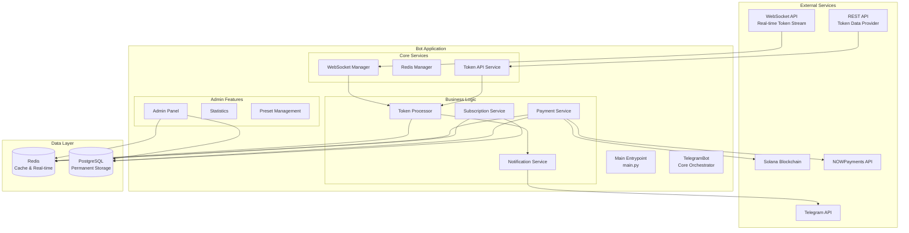
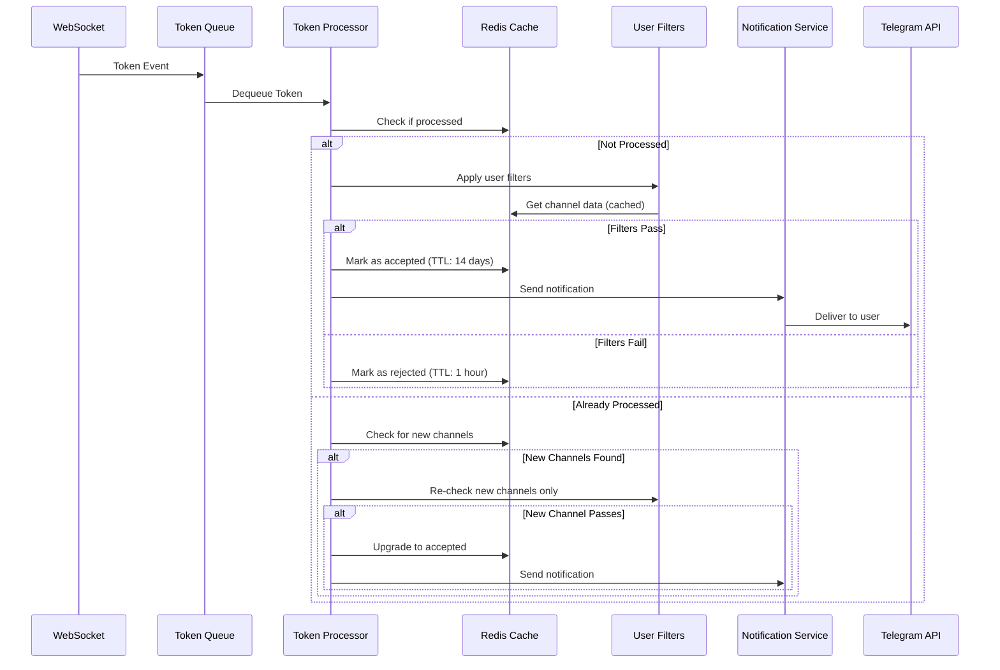
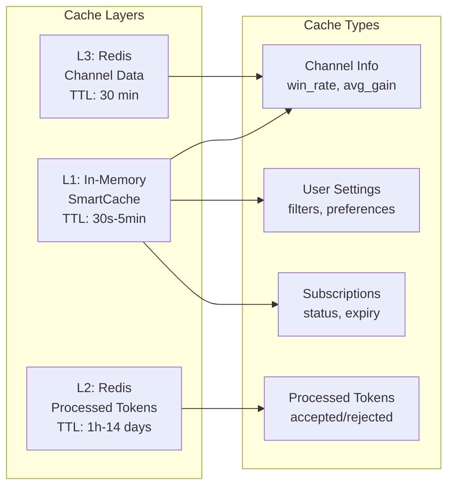
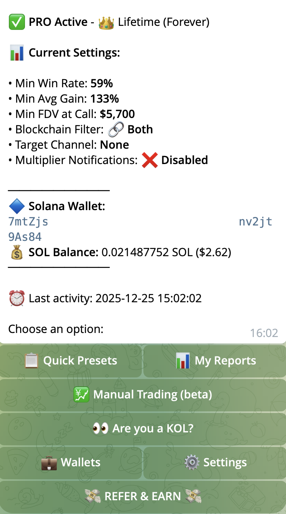
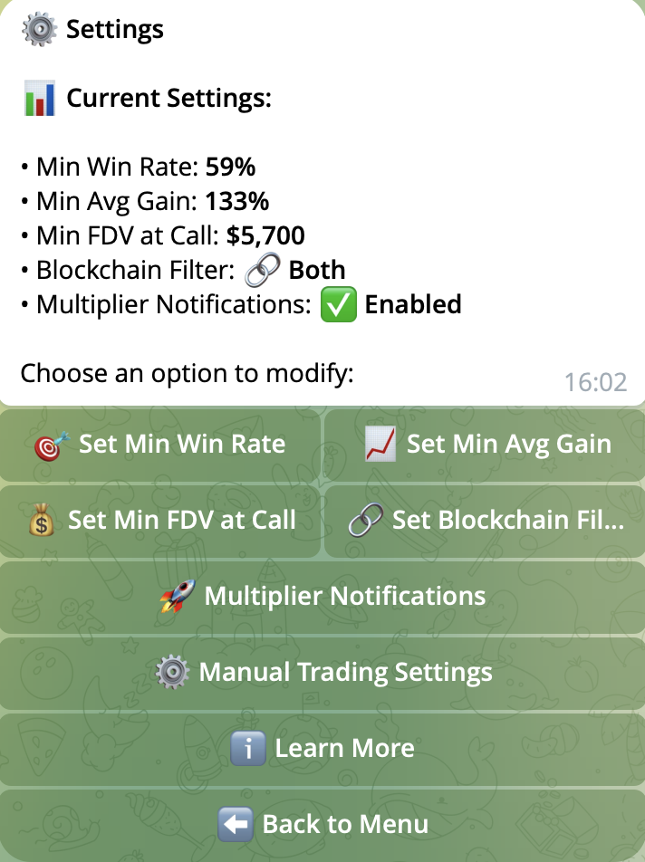
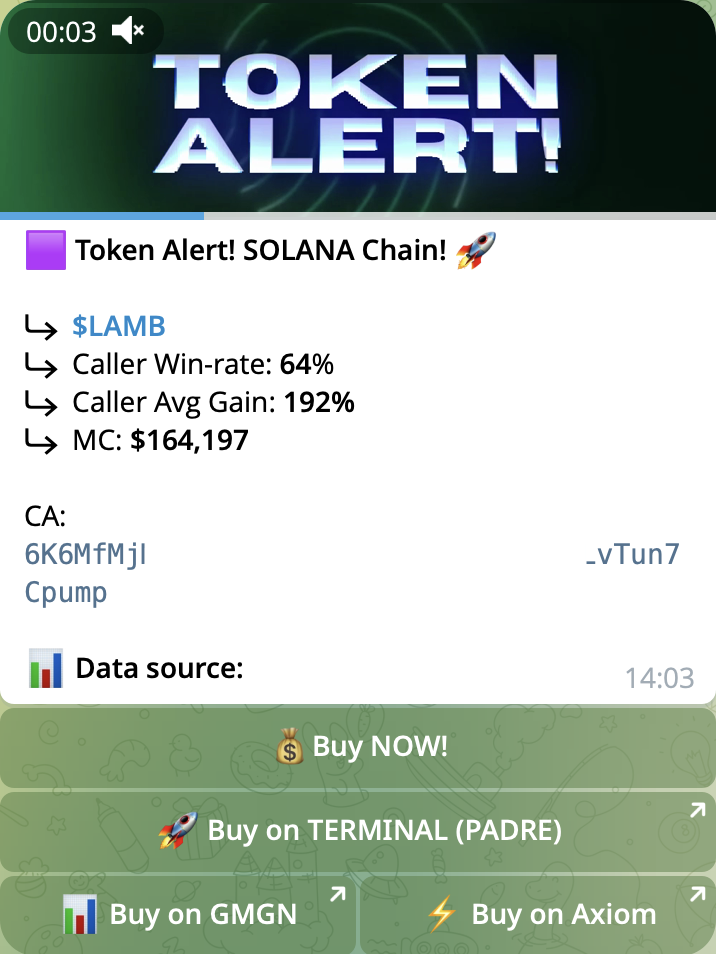
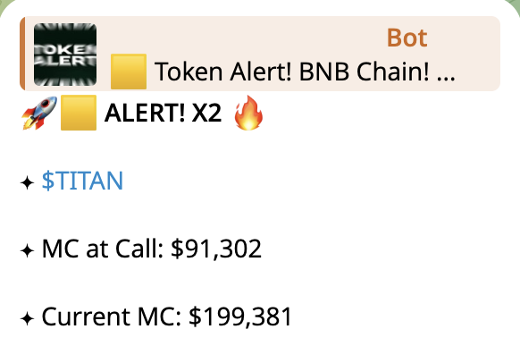
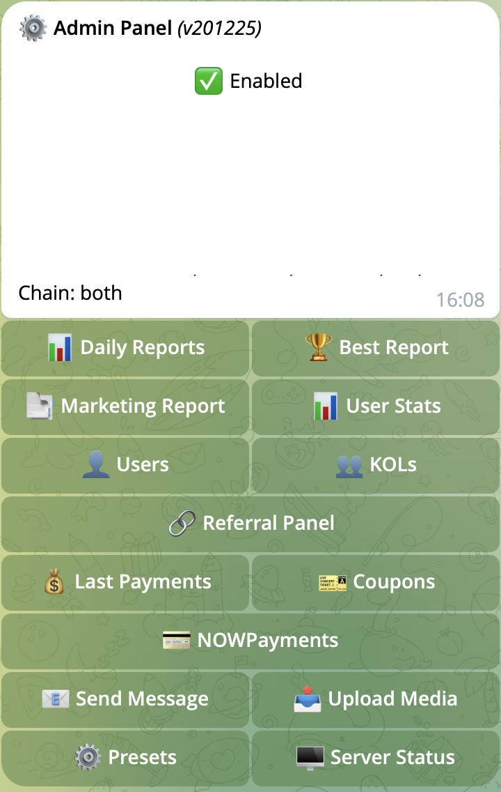
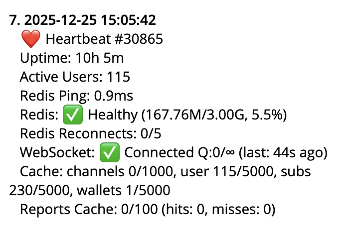

# Crypto Trading Analytics Bot - Portfolio Showcase


> **⚠️ Disclaimer:** This is a commercial project developed for a fintech startup. Due to Non-Disclosure Agreements (NDA), the source code is private. This repository contains architectural documentation and technical overview to demonstrate my skills and the system's complexity.

## 📋 Table of Contents

- [Overview](#overview)
- [Architecture](#architecture)
- [Technical Highlights](#technical-highlights)
- [Key Features](#key-features)
- [Technology Stack](#technology-stack)
- [Challenges & Solutions](#challenges--solutions)
- [Performance Metrics](#performance-metrics)
- [Lessons Learned](#lessons-learned)
- [Screenshots & Demos](#screenshots--demos)
- [Additional Documentation](#additional-documentation)
- [Security & Privacy](#security--privacy)
- [License](#license)
- [Contact](#contact)

---

## <a id="overview"></a>🎯 Overview

A production-grade Telegram bot that monitors cryptocurrency token signals in real-time, filters them based on user-defined criteria, and delivers personalized notifications. The system handles payments, subscriptions, admin management, and complex caching strategies to serve 100+ concurrent users processing 25,000+ tokens.

**Project Type:** Commercial Fintech Application  
**Role:** Full-Stack Developer / System Architect  
**Status:** Production (Active)

---

## <a id="architecture"></a>🏗️ Architecture

### High-Level System Architecture



### Data Flow: Token Processing



### Caching Strategy



---

## <a id="technical-highlights"></a>⚡ Technical Highlights

### 1. **Smart Token Processing with Re-check Logic**

The system implements intelligent token processing that:
- Caches rejected tokens for 1 hour (allows re-checking when new channels appear)
- Caches accepted tokens for 14 days (prevents duplicate notifications)
- Only re-processes **new channels** when a previously rejected token appears again
- Reduces API calls by 90%+ through strategic caching

**Performance Impact:**
- First-time processing: ~50-100ms per token
- Re-check (new channels only): ~10-20ms per token
- Cache hit rate: ~95% for processed tokens

### 2. **WebSocket Flood Protection**

**Challenge:** WebSocket can send thousands of token events per minute, overwhelming the system.

**Solution:**
- Queue-based processing with configurable capacity (10,000 tokens)
- Rate limiting: max 100 API calls/minute
- Semaphore-based concurrency control (max 5 concurrent user processing)
- Smart deduplication using Redis with atomic operations

**Result:** System handles 25,000+ tokens with 100 concurrent users without degradation.

### 3. **Multi-Layer Caching Architecture**

**Implementation:**
- **L1 Cache (In-Memory):** SmartCache with LRU eviction, TTL-based expiration
  - Channel data: 30 min TTL
  - User settings: 5 min TTL
  - Subscriptions: 5 min TTL
- **L2 Cache (Redis):** Persistent cache with dynamic TTL
  - Accepted tokens: 14 days
  - Rejected tokens: 1 hour
  - Channel metadata: 30 min

**Performance Gains:**
- Cache hit rate: 95%+ for channel data
- Reduced API calls: from ~1000/min to ~50/min
- Response time: 0.1ms (cache) vs 200ms (API call)

### 4. **Optimized Multiplier Tracking System**

**Challenge:** Track price multipliers for 2.5M+ token calls across 100 users in real-time.

**Solution:**
- In-memory cache mapping: `token_address → [user_ids]` (O(1) lookup)
- Replaced Redis SCAN (O(N)) with dictionary lookup
- **1000x performance improvement:** 0.5s → 0.0001s per price update

**Code Example (Sanitized):**
```python
# Before: Redis SCAN (slow)
all_calls = await storage.get_tracked_calls_for_token(redis_client, token_address)
# Time: ~500ms for 100 users

# After: In-memory cache (fast)
user_ids = self.tracked_tokens_by_token.get(token_address, [])
# Time: ~0.1ms (5000x faster)
```

### 5. **Dual-Write Architecture (Redis + PostgreSQL)**

**Challenge:** Need both fast real-time operations (Redis) and permanent storage for analytics (PostgreSQL).

**Solution:**
- **Redis:** Primary storage for hot data (subscriptions, cache, real-time state)
- **PostgreSQL:** Permanent storage for analytics, audit trail, and historical data
- **Dual-write pattern:** Write to both systems asynchronously
- **Graceful degradation:** System continues if PostgreSQL fails (Redis is critical)
- **Connection pooling:** Async PostgreSQL with connection pool (5-20 connections)

**Data Flow:**
- Subscriptions: Redis (fast) + PostgreSQL (permanent)
- Payments: Redis (fast) + PostgreSQL (audit trail)
- User activity: PostgreSQL (analytics)
- Token performance: PostgreSQL (historical tracking)

**Result:** Best of both worlds - fast operations + permanent storage for analytics.

### 6. **Resilient Redis Connection Management**

**Features:**
- Automatic reconnection with exponential backoff
- Health monitoring (checks every 30s)
- Circuit breaker pattern (stops retrying after threshold)
- Graceful degradation (runtime fallback cache)
- Connection pooling with timeout handling

**Result:** 99.9% uptime even during Redis maintenance windows.

### 7. **Telegram Rate Limiting**

**Implementation:**
- Per-user rate limiter: 1 message/second
- Global rate limiter: ~30 messages/second
- Priority queue for menu updates (bypasses per-user limit)
- Automatic retry with exponential backoff

**Result:** Zero Telegram API bans, smooth user experience.

---

## <a id="key-features"></a>🚀 Key Features

### User Features
- ✅ Real-time token monitoring via WebSocket
- ✅ Customizable filters (win rate, avg gain, FDV, blockchain)
- ✅ Multiple subscription tiers (Daily, Weekly, Monthly, Lifetime)
- ✅ Solana wallet payment integration
- ✅ NOWPayments integration (fiat/crypto)
- ✅ Coupon/discount code support
- ✅ Multiplier tracking (price alerts)
- ✅ Preset configurations for quick setup

### Admin Features
- ✅ User management (lock/unlock, extend subscriptions)
- ✅ Statistics dashboard
- ✅ Preset management (create, edit, optimize)
- ✅ Coupon management
- ✅ Bulk messaging
- ✅ Media upload system
- ✅ Server status monitoring
- ✅ Payment reconciliation

### Technical Features
- ✅ Docker containerization
- ✅ Redis health monitoring
- ✅ PostgreSQL dual-write architecture
- ✅ Comprehensive logging (rotating logs)
- ✅ Error tracking and alerting
- ✅ Graceful shutdown handling
- ✅ Auto-restart wrapper
- ✅ Performance metrics collection
- ✅ Analytics tables (user activity, token performance, notifications)

---

## <a id="technology-stack"></a>🛠️ Technology Stack

### Core Technologies
- **Language:** Python 3.11+
- **Framework:** python-telegram-bot 22.3
- **Async Runtime:** asyncio
- **WebSocket:** python-socketio 5.11.0
- **HTTP Client:** aiohttp 3.10.11

### Data & Caching
- **Cache:** Redis 7+ (with persistence) - Primary storage for real-time operations
- **Database:** PostgreSQL 14+ (asyncpg) - Permanent storage for analytics and audit trail

### Infrastructure
- **Containerization:** Docker + Docker Compose
- **Process Management:** systemd (production)
- **Monitoring:** Custom health checks + logging

### External Integrations
- **Telegram Bot API**
- **Solana Blockchain** (wallet verification)
- **NOWPayments** (payment gateway)
- **Token Data API** (external token data provider)

---

## <a id="challenges--solutions"></a>🎯 Challenges & Solutions

### Challenge 1: WebSocket Data Flood
**Problem:** WebSocket sends 1000+ token events/minute, overwhelming the system.

**Solution:**
- Queue-based processing (10,000 capacity)
- Rate limiting (100 API calls/minute)
- Batch processing with semaphores
- Smart deduplication

**Result:** Handles 25K+ tokens with 100 users without performance degradation.

---

### Challenge 2: Redis SCAN Performance
**Problem:** Redis SCAN operations for 2.5M+ keys were taking 5-10 seconds.

**Solution:**
- Replaced SCAN with in-memory cache (`token → users` mapping)
- O(1) dictionary lookup instead of O(N) SCAN
- Cache rebuilt on startup, updated incrementally

**Result:** 1000x performance improvement (0.5s → 0.0001s).

---

### Challenge 3: Token Re-check Logic
**Problem:** When a token is rejected, new channels may appear later. Need to re-check without processing all channels again.

**Solution:**
- Store `channels_checked` list in Redis
- On re-check, compare current channels with previous
- Only process **new channels** that weren't checked before
- Atomic upgrade from "rejected" to "accepted" status

**Result:** 90% reduction in redundant API calls.

---

### Challenge 4: Subscription Check Performance
**Problem:** Every notification requires subscription check, causing latency.

**Solution:**
- SmartCache with 5-minute TTL
- Cache hit: instant (0.1ms)
- Cache miss: Redis lookup with 3s timeout
- Graceful degradation (skip notification if timeout)

**Result:** 95%+ cache hit rate, <1ms average latency.

---

### Challenge 5: Telegram Rate Limits
**Problem:** Telegram limits: 30 messages/second globally, risk of bans.

**Solution:**
- Per-user rate limiter (1 msg/sec)
- Global rate limiter (30 msg/sec)
- Priority queue for menu updates
- Automatic retry with exponential backoff

**Result:** Zero bans, smooth user experience.

---

## <a id="performance-metrics"></a>📊 Performance Metrics

### Scalability
- **Users:** 100+ concurrent users
- **Tokens:** 25,000+ tokens tracked
- **Tracked Calls:** 2.5M+ multiplier tracking entries
- **Throughput:** 1000+ token events/minute
- **Cache Hit Rate:** 95%+

### Response Times
- **Cache Lookup:** 0.1ms
- **Token Processing:** 50-100ms (first time)
- **Re-check (new channels):** 10-20ms
- **Price Update Processing:** 0.1ms (cache) vs 500ms (SCAN)
- **Subscription Check:** <1ms (cache hit), 50-200ms (cache miss)

### Resource Usage
- **Memory:** ~2.5MB cache, ~1.5GB Redis data
- **CPU:** Low (async I/O bound)
- **Network:** Optimized with connection pooling

### Reliability
- **Uptime:** 99.9%+
- **Redis Reconnection:** Automatic (< 10s)
- **WebSocket Reconnection:** Automatic (< 10s)
- **Error Recovery:** Graceful degradation

---

## <a id="lessons-learned"></a>💡 Lessons Learned

This project was a significant learning experience. Here are key insights and reflections:

### What Went Well

**1. Dual-Write Architecture Decision**
- Starting with Redis-only was the right call for MVP - fast iteration, simple setup
- Adding PostgreSQL later as a separate layer (dual-write) allowed gradual migration without breaking changes
- **Lesson:** Sometimes the "perfect" architecture can wait - ship fast, optimize later

**2. In-Memory Cache for Multiplier Tracking**
- The 1000x performance improvement (Redis SCAN → in-memory dict) was a game-changer
- **Lesson:** Question assumptions - "Redis is fast" doesn't mean it's always the right tool. Sometimes a simple Python dict beats a database.

**3. Smart Token Re-check Logic**
- The incremental re-check approach (only new channels) reduced API calls by 90%
- **Lesson:** Think about data lifecycle - rejected doesn't mean "never check again"

### What Could Be Improved

**1. Architecture Evolution**
- **If I started today:** I'd use PostgreSQL from day 1 with Redis as pure cache layer
- **Why:** Would save migration effort, but MVP speed was more valuable at the time
- **Trade-off:** Speed vs. "perfect" architecture - chose speed, no regrets

**2. Error Handling**
- Some edge cases were discovered in production (WebSocket reconnects, Redis timeouts)
- **Lesson:** Production is the best test environment, but more comprehensive testing upfront would have caught these

**3. Monitoring & Observability**
- Added monitoring after issues appeared
- **If I started today:** Would include Prometheus/Grafana from day 1
- **Lesson:** Observability isn't optional - it's a feature

### Technical Insights

**1. Async/Await Complexity**
- Managing 100+ concurrent users with async Python requires careful resource management
- **Key learning:** Semaphores and rate limiters are essential, not optional
- **Surprise:** Python's asyncio is powerful but requires discipline

**2. Cache Strategy**
- Three-layer caching (in-memory → Redis → API) was crucial for performance
- **Lesson:** Cache everything that doesn't change frequently, but set proper TTLs
- **Mistake:** Initially cached too aggressively, had to add TTLs later

**3. Database Design**
- PostgreSQL schema evolved organically (added analytics tables later)
- **If I started today:** Would design with analytics in mind from the start
- **Lesson:** Schema design is hard to change - think ahead, but don't over-engineer

### Process & Methodology

**1. Testing Strategy**
- Unit tests caught many bugs, but integration tests would have caught more
- **Lesson:** Test at the right level - unit tests for logic, integration tests for flows

**2. Documentation**
- Writing this portfolio documentation made me realize how much I learned
- **Lesson:** Documenting decisions helps future you (and others) understand "why"

**3. Performance Optimization**
- Premature optimization is real - but so is "too late" optimization
- **Balance:** Profile first, optimize bottlenecks, measure impact

### Biggest Takeaways

1. **Start simple, optimize later** - Redis-only was fine for MVP, PostgreSQL came when needed
2. **Question assumptions** - Redis SCAN seemed fine until it wasn't at scale
3. **Production teaches you** - No amount of planning replaces real-world usage
4. **Architecture evolves** - What works at 10 users might not work at 100
5. **Monitoring is critical** - You can't fix what you can't see

### What I'd Do Differently

- **Add PostgreSQL earlier** - But only if I had time, MVP speed was more important
- **More integration tests** - Would catch edge cases earlier
- **Better observability** - Metrics and dashboards from day 1
- **Documentation as code** - Keep architecture docs in sync with code

### What I'm Proud Of

- **Performance at scale** - System handles 25K+ tokens with 100 users smoothly
- **Resilience** - 99.9% uptime even during Redis maintenance
- **User experience** - Zero Telegram API bans, fast response times
- **Architecture** - Clean separation of concerns, maintainable codebase

---

## <a id="screenshots--demos"></a>📸 Screenshots & Demos

### Telegram Bot Interface


*Interactive main menu with all bot features*


*User settings configuration (filters, blockchain selection)*


*Real-time token alert with channel information and filters*


*Price multiplier notification (2x, 5x, 10x+ alerts)*

### Admin Panel


*Admin panel with user management, statistics, and system controls*


*System monitoring dashboard (CPU, RAM, Redis, PostgreSQL health)*

### Database Architecture

- **[PostgreSQL Schema Diagram](./database-schema-diagram.md)** - Complete database schema with 10 tables (5 core + 5 analytics) and relationships
- **[Redis Key Structure](./redis-key-structure.md)** - Redis key naming conventions, TTL strategy, and data organization

### Additional Screenshots (Optional):

1. **System Architecture Diagrams**
   - High-level architecture (Redis + PostgreSQL dual-write)
   - Data flow diagrams
   - Caching strategy visualization

2. **Telegram Bot Interface**
   - Main menu (with sensitive data blurred)
   - Settings/filters configuration
   - Token notification example
   - Multiplier alert example

3. **Admin Panel**
   - Admin dashboard overview
   - User statistics (with sensitive data blurred)
   - Server status monitoring
   - Payment statistics

4. **Performance Metrics**
   - Cache hit rate charts
   - Response time comparisons
   - Throughput metrics

> **Security Note:** All screenshots should have sensitive data (chat IDs, token addresses, transaction hashes) blurred or masked before publishing.

---

## <a id="additional-documentation"></a>📚 Additional Documentation

- [Architecture Details](./ARCHITECTURE.md) - Detailed system architecture
- [Technical Highlights](./TECHNICAL_HIGHLIGHTS.md) - Deep dive into key solutions
- [Code Examples](./CODE_EXAMPLES.md) - Sanitized code snippets

### Database Documentation
- [PostgreSQL Schema Diagram](./database-schema-diagram.md) - Complete database schema with ERD diagram
- [Redis Key Structure](./redis-key-structure.md) - Redis key naming conventions and data organization
- [Database Diagrams Instructions](./database-diagrams-instructions.md) - How to create visual diagrams (optional)

---

## <a id="security--privacy"></a>🔒 Security & Privacy

- All sensitive data (API keys, tokens, user data) removed from this repository
- Production code is private (NDA-protected)
- This repository contains only architectural documentation
- No actual credentials or business logic exposed

---

## <a id="license"></a>📝 License

This documentation is licensed under [Creative Commons Attribution-NonCommercial 4.0 International License](LICENSE) (CC BY-NC 4.0).

**What this means:**
- ✅ You can share and adapt this documentation
- ✅ You must give appropriate credit
- ❌ You cannot use it for commercial purposes

**Note:** The actual source code is proprietary and protected by NDA. This repository contains only architectural documentation.

---

## <a id="contact"></a>👤 Contact

For inquiries about this project or collaboration opportunities, please reach out via:
- GitHub: [https://github.com/adamsosx/]


---

**Last Updated:** 2025-12-25  
**Project Status:** Production (Active)  
**Version:** v2.0 (PostgreSQL Dual-Write Architecture)
