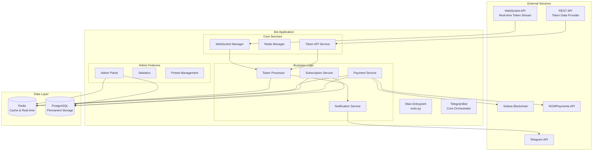
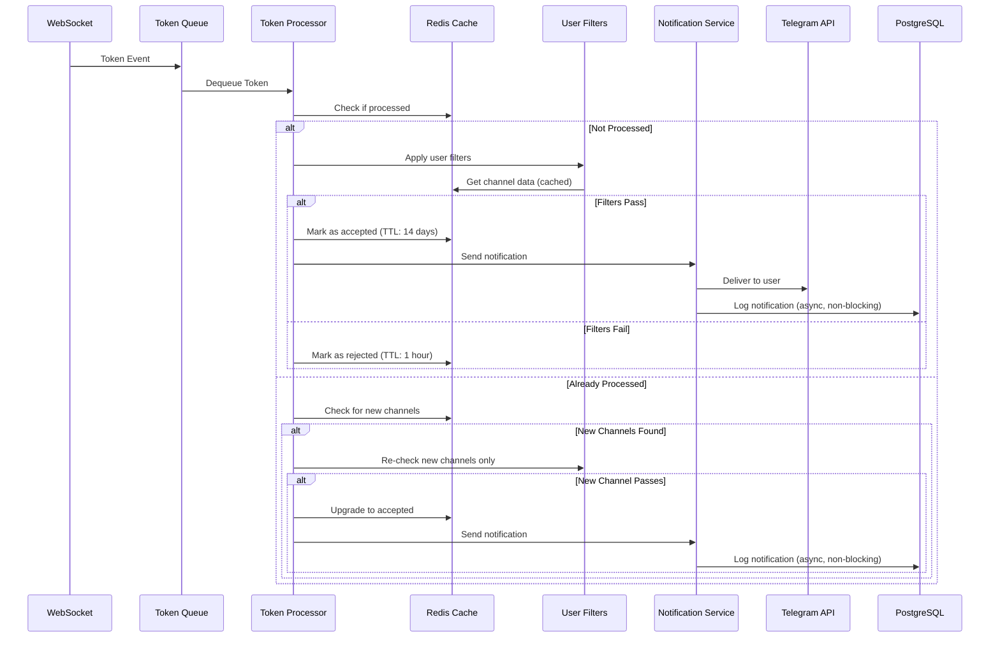
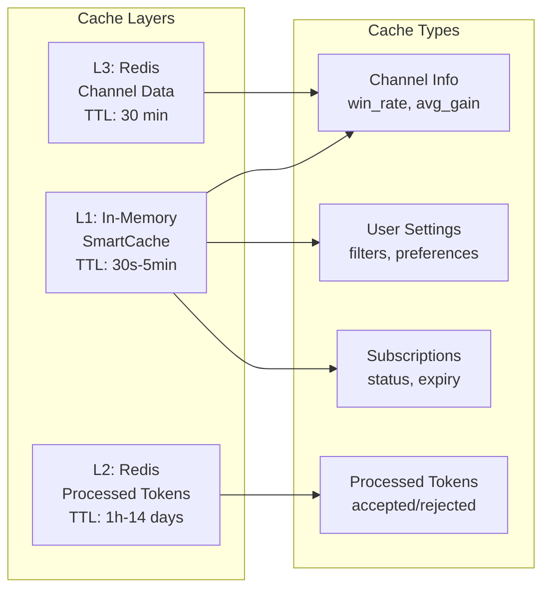
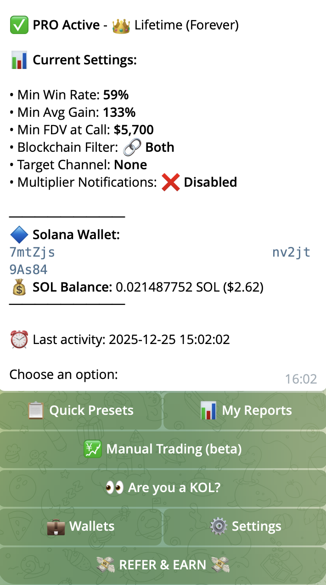
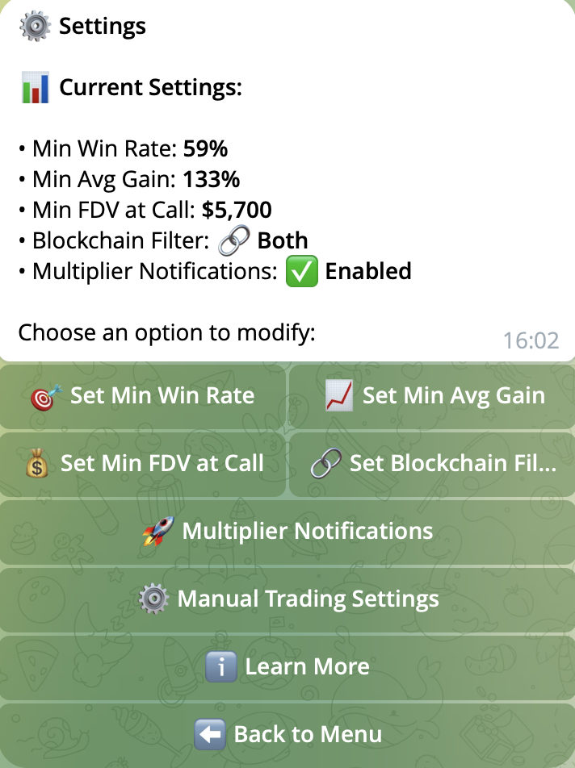
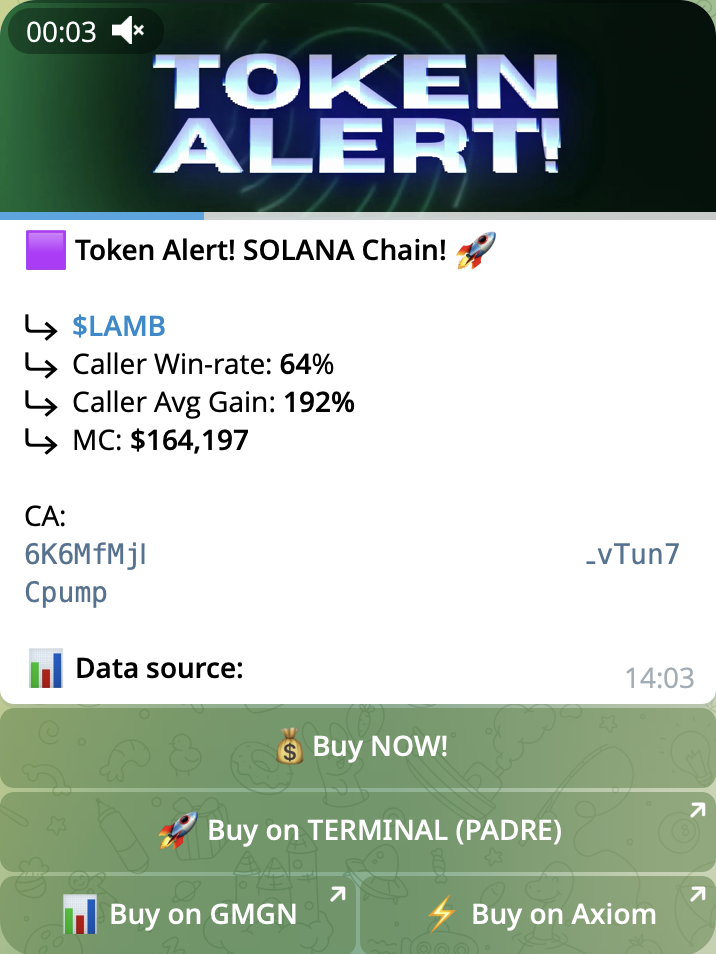
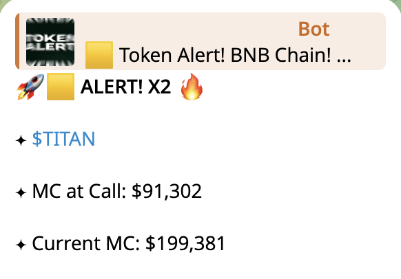
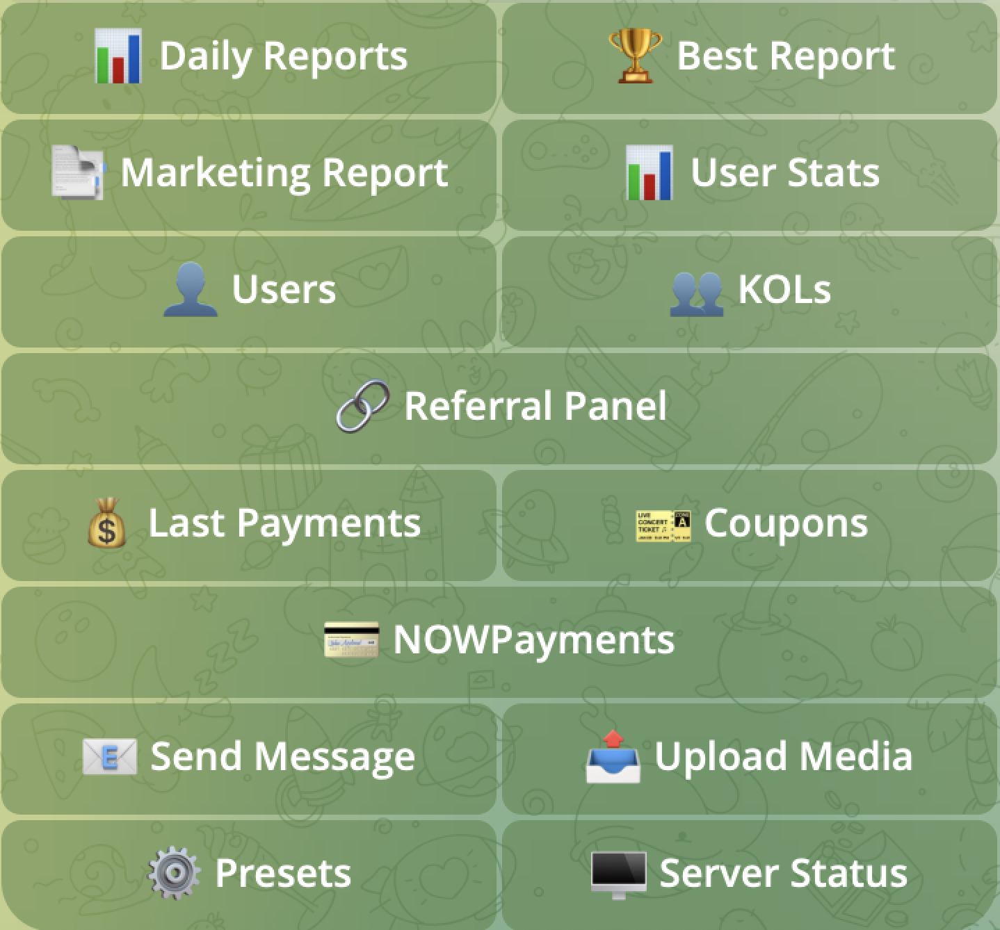
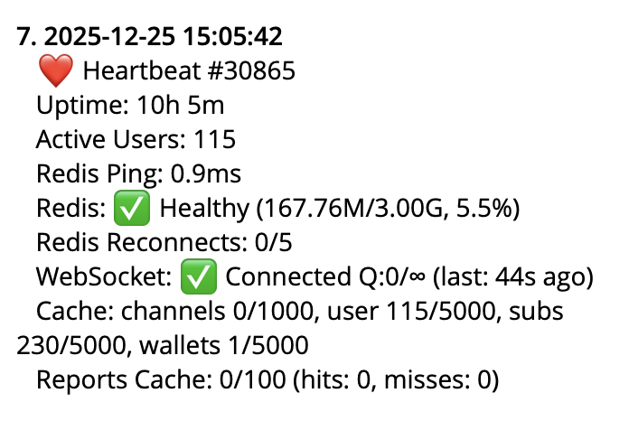

# Crypto Trading Analytics Bot — Portfolio Showcase


> Note: commercial project developed for a fintech startup under NDA. Source code is private. This repository contains architectural documentation and sanitized code snippets illustrating the design.

## Table of Contents

- [Overview](#overview)
- [Architecture](#architecture)
- [Technical Highlights](#technical-highlights)
- [Key Features](#key-features)
- [Technology Stack](#technology-stack)
- [Challenges & Solutions](#challenges--solutions)
- [Scale & Observed Behavior](#scale--observed-behavior)
- [Trade-offs & What I'd Change](#trade-offs)
- [Screenshots](#screenshots)
- [Additional Documentation](#additional-documentation)
- [Security & Privacy](#security--privacy)
- [License](#license)
- [Contact](#contact)

---

## <a id="overview"></a>Overview

A production Telegram bot that ingests real-time token-signal events, applies per-user filters, and delivers targeted notifications — with subscription management, Solana / NOWPayments billing, and an admin panel. The hot path is backed by Redis; an async dual-write to PostgreSQL provides analytics and audit trail without blocking user flows.

**Project Type:** Commercial fintech application (closed source, NDA)
**Role:** Full-Stack Developer / System Architect
**Stack:** Python 3.11 async, Redis, PostgreSQL, python-telegram-bot, aiohttp, Docker

---

## <a id="architecture"></a>Architecture

### High-Level System Architecture


```mermaid
graph TB
    subgraph "External Services"
        WS[WebSocket API<br/>Real-time Token Stream]
        API[REST API<br/>Token Data Provider]
        TG[Telegram API]
        SOL[Solana Blockchain]
        NP[NOWPayments API]
    end
    
    subgraph "Bot Application"
        MAIN[Main Entrypoint<br/>main.py]
        BOT[TelegramBot<br/>Core Orchestrator]
        
        subgraph "Core Services"
            WS_MGR[WebSocket Manager]
            REDIS_MGR[Redis Manager]
            API_SVC[Token API Service]
        end
        
        subgraph "Business Logic"
            TOKEN_PROC[Token Processor]
            NOTIF[Notification Service]
            PAY[Payment Service]
            SUB[Subscription Service]
        end
        
        subgraph "Admin Features"
            ADMIN[Admin Panel]
            STATS[Statistics]
            PRESETS[Preset Management]
        end
    end
    
    subgraph "Data Layer"
        REDIS[(Redis<br/>Cache & Real-time)]
        PG[(PostgreSQL<br/>Permanent Storage)]
    end
    
    WS --> WS_MGR
    API --> API_SVC
    WS_MGR --> TOKEN_PROC
    API_SVC --> TOKEN_PROC
    TOKEN_PROC --> NOTIF
    NOTIF --> TG
    PAY --> SOL
    PAY --> NP
    TOKEN_PROC --> REDIS
    PAY --> REDIS
    PAY --> PG
    SUB --> REDIS
    SUB --> PG
    ADMIN --> REDIS
    ADMIN --> PG
```

### Data Flow: Token Processing


```mermaid
sequenceDiagram
    participant WS as WebSocket
    participant Queue as Token Queue
    participant Processor as Token Processor
    participant Redis as Redis Cache
    participant Filter as User Filters
    participant Notif as Notification Service
    participant TG as Telegram API
    participant PG as PostgreSQL
    
    WS->>Queue: Token Event
    Queue->>Processor: Dequeue Token
    Processor->>Redis: Check if processed
    alt Not Processed
        Processor->>Filter: Apply user filters
        Filter->>Redis: Get channel data (cached)
        alt Filters Pass
            Processor->>Redis: Mark as accepted (TTL: 14 days)
            Processor->>Notif: Send notification
            Notif->>TG: Deliver to user
            Notif->>PG: Log notification (async, non-blocking)
        else Filters Fail
            Processor->>Redis: Mark as rejected (TTL: 1 hour)
        end
    else Already Processed
        Processor->>Redis: Check for new channels
        alt New Channels Found
            Processor->>Filter: Re-check new channels only
            alt New Channel Passes
                Processor->>Redis: Upgrade to accepted
                Processor->>Notif: Send notification
                Notif->>PG: Log notification (async, non-blocking)
            end
        end
    end
```

### Caching Strategy


```mermaid
graph LR
    subgraph "Cache Layers"
        L1[L1: In-Memory<br/>SmartCache<br/>TTL: 30s-5min]
        L2[L2: Redis<br/>Processed Tokens<br/>TTL: 1h-14 days]
        L3[L3: Redis<br/>Channel Data<br/>TTL: 30 min]
    end
    
    subgraph "Cache Types"
        CHAN[Channel Info<br/>win_rate, avg_gain]
        USER[User Settings<br/>filters, preferences]
        SUB[Subscriptions<br/>status, expiry]
        TOKEN[Processed Tokens<br/>accepted/rejected]
    end
    
    L1 --> CHAN
    L1 --> USER
    L1 --> SUB
    L2 --> TOKEN
    L3 --> CHAN
```

---

## <a id="technical-highlights"></a>Technical Highlights

### 1. Smart Token Processing with Re-check Logic

When a token is first seen but rejected (no channels meet user filters), it's cached in Redis for 1 hour rather than indefinitely — so if a new channel calls the same token later, we can re-evaluate. Accepted tokens are cached for 14 days to prevent duplicate notifications.

On re-check, we don't reprocess all channels — we compare the current `channel_calls` list against the stored `channels_checked` set and only evaluate the delta. This avoids re-paying the per-channel API cost for channels we've already rejected.

### 2. WebSocket Flood Protection

Upstream WebSocket bursts can exceed sustained processing capacity. The mitigation stack:

- Queue-based ingestion (`asyncio.Queue`, capacity 10,000) — buffers spikes, provides back-pressure
- Rate limiter on outbound API calls (~100 / minute) — protects the upstream token data provider
- Semaphore on per-user processing (max 5 concurrent) — bounds Telegram + Redis fan-out
- Redis-level deduplication with atomic `SET ... NX` — avoids double-processing across worker restarts

### 3. Multi-Layer Caching Architecture

- **L1 — In-memory `SmartCache`:** LRU with TTL, per-cache sizing. Channel data (30 min), user settings (5 min), subscriptions (5 min). Sub-millisecond lookup.
- **L2 — Redis:** processed-token state (1 h for rejected, 14 d for accepted), channel metadata (30 min). Survives process restarts.
- **L3 — External API:** only reached on full cache miss.

Hit rate measured on a working day sat above 90% for channel metadata — enough that the API budget stopped being the bottleneck.

### 4. Multiplier Tracking — SCAN Replacement

The original hot-path used `redis.SCAN(match="multiplier:{token}:*")` to find which users had a given token tracked. At 2.5M tracking entries this walked the entire key space per price update — sub-second, but too slow for a price-stream cadence.

Replaced with an in-memory `dict[token_address, list[user_id]]` kept consistent with Redis (rebuilt from SCAN once on startup, mutated on every `track_call`). Lookup becomes a single `dict.get()`:

```python
# Before: SCAN over matching keys (O(N) over keyspace)
user_ids = await storage.get_tracked_calls_for_token(redis, token_address)

# After: dict lookup (O(1))
user_ids = self.tracked_tokens_by_token.get(token_address, [])
```

The mechanical change is O(N) → O(1). Wall-clock depends on keyspace size; at our scale it moved from "noticeable on the event loop" to "unmeasurable noise".

### 5. Dual-Write Architecture (Redis + PostgreSQL)

Hot path stays on Redis (fast lookups, real-time state). PostgreSQL is a second write destination for analytics, audit trail, and historical queries — written **asynchronously and non-blocking**, so a PostgreSQL outage degrades analytics but not user experience.

- Subscriptions: Redis (primary) + PostgreSQL (history)
- Payments: Redis (hot) + PostgreSQL (audit trail)
- User activity logs: PostgreSQL only (not on the critical path)
- Token performance: PostgreSQL only (reports, not real-time)

Trade-off accepted: the two stores can drift transiently on PostgreSQL failure. Reconciliation happens on recovery; Redis is treated as source of truth for anything the user sees in-session.

### 6. Resilient Redis Connection Management

- Automatic reconnection with exponential backoff (2ⁿ, capped at 30s)
- Health check every 30s (measure ping latency, warn if > 1s)
- Circuit breaker: after a threshold of unhealthy time, stop retrying and route to fallback
- Fallback: in-memory `_processed_runtime` dict — serves reads while Redis is down, reconciled on reconnect

### 7. Telegram Rate Limiting

Two stacked limiters:

- Per-user (1 msg / sec) via per-user `asyncio.Lock` + last-sent timestamp
- Global (~30 msg / sec) via a token-bucket limiter

Menu-update operations bypass the per-user limit (user-visible latency matters there; overall volume is bounded by user action). Bans from Telegram's rate enforcement stopped being a concern after this layer was in place — the client-side limits are stricter than what Telegram enforces.

---

## <a id="key-features"></a>Key Features

### User-facing
- Real-time token monitoring via WebSocket
- Customizable filters (win rate, avg gain, FDV, blockchain)
- Multiple subscription tiers (daily, weekly, monthly, lifetime)
- Solana wallet payments (on-chain verification)
- NOWPayments integration (fiat / alt-crypto)
- Coupon / discount codes
- Price-multiplier alerts (2×, 5×, 10×, 20×, 50×, 100× thresholds)
- Preset configurations for quick filter setup

### Admin
- User management (lock/unlock, extend subscriptions)
- Statistics dashboard
- Preset management (create, edit, optimize)
- Coupon management
- Bulk messaging
- Media upload
- Server-status monitoring
- Payment reconciliation

### Technical / operational
- Docker containerization
- Redis health monitoring + circuit breaker
- PostgreSQL dual-write (async, non-blocking)
- Rotating log files, per-concern log separation
- Error tracking and alerting
- Graceful shutdown handling
- Auto-restart wrapper (systemd in production)
- Analytics tables (user activity, token performance, notifications)

---

## <a id="technology-stack"></a>Technology Stack

### Core Technologies
- **Language:** Python 3.11+
- **Framework:** python-telegram-bot 22.3
- **Async Runtime:** asyncio
- **WebSocket:** python-socketio 5.11.0
- **HTTP Client:** aiohttp 3.10.11

### Data & Caching
- **Cache:** Redis 7+ (with persistence) - Primary storage for real-time operations
- **Database:** PostgreSQL 14+ (asyncpg) - Permanent storage for analytics and audit trail

### Infrastructure
- **Containerization:** Docker + Docker Compose
- **Process Management:** systemd (production)
- **Monitoring:** Custom health checks + logging

### External Integrations
- **Telegram Bot API**
- **Solana Blockchain** (wallet verification)
- **NOWPayments** (payment gateway)
- **Token Data API** (external token data provider)

---

## <a id="challenges--solutions"></a>Challenges & Solutions

### Challenge 1: WebSocket event bursts
Upstream stream could burst past sustained processing capacity. Mitigated with a 10,000-capacity `asyncio.Queue`, an outbound-API rate limiter (~100 / minute), a per-user concurrency semaphore (max 5), and atomic Redis dedup. The bursts now fill the queue briefly and drain rather than dropping events or hammering downstream APIs.

### Challenge 2: Redis SCAN on the multiplier hot path
`SCAN` over millions of `multiplier:*` keys was the dominant cost on every price update. Replaced with an in-memory `dict[token_address, list[user_id]]` rebuilt at startup and mutated on every `track_call`. Mechanical complexity change: O(N) over keyspace → O(1). Lookup moved from "visible on the event loop" to "unmeasurable noise".

### Challenge 3: Token re-check without re-processing every channel
When a token is rejected, new channels may call it later. Storing `channels_checked` and `channels_called_at` per processed token lets the re-check pass compute the delta (new channels only), with an atomic upgrade from `rejected` → `accepted` if any of the deltas pass. Avoids re-paying the per-channel API cost for channels already evaluated.

### Challenge 4: Subscription check on every notification
Every outbound notification required a subscription lookup — a lot of Redis traffic. Cached in `SmartCache` (5-min TTL), with a 3s Redis timeout and skip-on-timeout on miss. Cache hit rate is high enough that the vast majority of notifications never touch Redis for this check.

### Challenge 5: Telegram rate limits
Telegram enforces ~30 msg/sec globally and bans on sustained overruns. Two stacked limiters (per-user 1 msg/s, global 30 msg/s) plus a bypass for menu-updates (user-facing latency, bounded volume) keep the client below the enforcement threshold at all times.

---

## <a id="scale--observed-behavior"></a>Scale & Observed Behavior

Rough operating envelope during the engagement (order-of-magnitude, from internal dashboards I don't have access to post-ship — exact figures not published here):

- User count: hundreds of concurrent users
- Token events: tens of thousands per day
- Multiplier tracking entries: a few million across all users
- Inbound event cadence: up to ~1k / minute during bursts

Observed behavior under this load:

- Hot path stays sub-millisecond on cache hits (SmartCache L1).
- Redis hit rate on channel metadata high enough that the external token API is not the bottleneck.
- Price-update processing doesn't appear on async-loop profiles after the SCAN→dict rewrite.
- PostgreSQL writes are off the critical path — a DB outage degrades analytics, not user experience.

Exact latency / hit-rate / uptime percentages aren't published here because I don't have reproducible measurements to back specific numbers.

---

## <a id="trade-offs"></a>Trade-offs & What I'd Change

- **Redis-first, PostgreSQL second was the right call for MVP** — fast to build, one store to reason about. The later dual-write migration was cheap because PostgreSQL writes were added at a well-defined seam (after Redis write succeeds). With hindsight I'd still start Redis-only; the migration was less work than designing for dual-write upfront.
- **Observability was retrofitted.** Metrics and health checks landed after the first production incidents, not before. A clean metrics backbone (Prometheus + structured logs) from day one would have shortened debugging time, at a small upfront cost.
- **Testing was unit-heavy, integration-light.** Edge cases around WebSocket reconnect and Redis timeout were found in production, not in CI. Integration tests with a real Redis + a mocked upstream would have caught them earlier.
- **Schema evolution on PostgreSQL was reactive** — analytics tables were added when a specific report was needed, not designed upfront. Not ideal if you can avoid it, but also hard to design analytics schemas before you know what questions the business will actually ask.

---

## <a id="screenshots"></a>Screenshots

### Telegram Bot Interface


*Interactive main menu with all bot features*


*User settings configuration (filters, blockchain selection)*


*Real-time token alert with channel information and filters*


*Price multiplier notification (2x, 5x, 10x+ alerts)*

### Admin Panel


*Admin panel with user management, statistics, and system controls*


*System monitoring dashboard (CPU, RAM, Redis, PostgreSQL health)*

### Database Architecture

- **[PostgreSQL Schema Diagram](./database-schema-diagram.md)** - Complete database schema with 10 tables (5 core + 5 analytics) and relationships
- **[Redis Key Structure](./redis-key-structure.md)** - Redis key naming conventions, TTL strategy, and data organization

Sensitive data (chat IDs, token addresses, transaction hashes) is blurred or masked in screenshots.

---

## <a id="additional-documentation"></a>Additional Documentation

- [ARCHITECTURE.md](./ARCHITECTURE.md) — system architecture, component breakdown, data flows
- [TECHNICAL_HIGHLIGHTS.md](./TECHNICAL_HIGHLIGHTS.md) — deep dives on specific problems
- [CODE_EXAMPLES.md](./CODE_EXAMPLES.md) — sanitized code snippets illustrating the patterns described
- [database-schema-diagram.md](./database-schema-diagram.md) — PostgreSQL ERD
- [redis-key-structure.md](./redis-key-structure.md) — Redis key naming and TTL policy

---

## <a id="security--privacy"></a>Security & Privacy

- API keys, tokens, and user data are not present in this repository — environment variables only in the actual deployment.
- Production code is private (NDA). This repository contains documentation and illustrative snippets only.
- Screenshots have sensitive identifiers blurred or masked.

---

## <a id="license"></a>License

Documentation in this repository is released under Creative Commons Attribution-NonCommercial 4.0 (CC BY-NC 4.0). Source code of the product itself is proprietary and not included here.

---

## <a id="contact"></a>Contact

- GitHub: [github.com/paradoxlabdev](https://github.com/paradoxlabdev)
- LinkedIn: _(to be added)_
- Email: _(on request via GitHub)_

---

*Last updated: April 2026*
